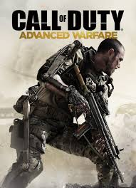

# 序章

### 序

其实最开始我是不想写序章的，也没有将这些文章做一个汇总的打算。

而我现在为什么要做种“口嫌体正直”的事情呢？大概是因为之前看了一些优秀的书籍和博文，觉得还是有必要讲一讲我的心路历程。

如果你听过或玩过使命召唤，那么你一定知道这是一个经久不衰的 FPS 游戏 IP。《call of duty》系列第一部于2003年，由动视公司发行，至今已经有17年了。正如同计算机编程现代计算机语言的发展，从上个世纪70年代兴起，至今也有一段不长不短的历史。《call of duty》系列里面最出名的作品便是现代战争三部曲：《Call of Duty 4: Modern Warfare》，《Call of Duty 6: Modern Warfare 2》 和 《Call of Duty 8: Modern Warfare 3》。当年我正值高一，在家里玩了这个系列的游戏，或被里面的战争场景所震撼，或被里面的故事剧情所打动。而后，使命召唤系列继续沿袭年作，直到第11部作品 《Call of Duty 11: Advanced Warfare》。

没错，本文系列 advanced java 中的  advanced 一词，正是取至于此。《Advanced Warfare》讲述的是2054年的未来战争，士兵使用外骨骼框架，无人机，未来武器和防具，正如同是对现代战争的一次进化。而程序的发展或不是如此。Java是一门经典的语言，而如今，随着时代的发展，将更多的新功能和新特性加入其中，这不正是程序语言的进化么？

在这里，讲一讲现代计算机语言发展的历史。

至上个世纪以来，程序语言一直走的都是高冷路线，即在高校学术里面传播，很少用在工业上。而在60，70年代，美国航天事业的发展，以及越南战争的需求。需要有一种语言，专门来处理列表，而这种用于 List Processing 的语言被称作Lisp。而后，这种语言也存在一些问题，即过于高深，毕竟是一堆教授和大牛搞出来的语言，而在一些大工程，需要工作协作时苦不堪言。而后到了90年代和新千年，便是过程式语言的提出，以符合人们思考的方式编程。而计算机正是在这个时候迅猛发展，硅谷的高楼拔地而起，互联网公司股价不断攀升，人们的生活方式也在翻天覆地地改变... 正如同借鉴前辈的经验， java 语言横空出世，而后其程序语言面对对象的思想深入人心。java语言不断发展，而后，近几年，Java8 ，作为一个里程碑版本，引入 lambda 表达式，函数式回归预示着人们又拾起了前人的慧根。这正是到目前为止的编程语言发展过程。

总结一下发展历程

 函数式 -> 过程式 -> 面向对象 -> 函数式回归 

而事实上函数式语言在70年代之后并没有停止不前，而是和面向对象语言并行发展的。这里就要讲一下两者的区别了。

面向对象语言是一条是自下而上的路线，从计算机底层指令开始往上抽象。我将其称作实践派。这一类语言，如Pascal，C，C++ ，从汇编写程序开始走起，偏向底层性能优化，如指针，内存，磁盘，创造了计算机的基础设施，如Linux等。正如同 GNU 自由基金会的那一群极客们，为我们创造了如此丰富的计算机应用。

函数式语言是一条是自上而下的路线，从数学本质开始，即一群高校的数学家和逻辑学家。以普林斯顿大学为首，如Alonzo Church 、Alan Turing、John von Neumann、John McCarthy、  Haskell curry、William Alvin Howard 等知名人物。Alonzo Church 给我们带来了lambda calculus ，而师徒关系的 Alan Turing 更不必多说，每年图灵奖都会颁发给对计算机界有巨大贡献的人。冯·诺伊曼架构深入人心，麦卡锡给予了 lisp 和人工智能的贡献。而鼎鼎大名的 Haskell curry ，不仅是一门语言以其名字所命名（Haskell），更是有定理以他的名字命名（柯里化，curry-howard 同构）。

而函数式语言这种以抽象来发展的方式，我将其称作学院派。这一类语言，如 lisp  ,虽然有数学的优美，但看起来却很不符合人类的逻辑习惯。但函数式语言是一直向前发展的。而后 lisp 出现了两个重要分支，一个是 scheme，极简主义哲学，作为计算机系入门课程的编程语言。而后，scheme的后继者， racket 受到不少人的青睐。而另一个是 common Lisp，带来了工程上的使用。如今要么是ML系语言，或者像 coq，haskell 等后继者也十分出名。coq 常用于形式化证明，而 haskell 在金融系统也有一席之地。

而如今两者亦有融合之势，如 scala，rust ，新的语言在使用命令式编程思想时，也会使用一些函数式思想。

时代是在发展的，正如同 《call of duty》 如今已经有了 16 部作品了，仍然在继续出新作。（说句题外话，使命召唤16又回到了现代战争系列，颇有函数式语言回归的姿态。）

而未来程序语言发展又会如何呢？

### 有趣的图

在这里，发一个我在网络上看到的有趣的图。

当然，这里郑恺说的是掌握知识需要全能。当学习了函数式编程后，会有一些新的见解，对计算机也会有更深刻的认识。

### 文章目录

- [01-advanced java （一） 继承和接口](docs/01-advancedjava（一）继承和接口.md)
- [02-advanced java （二） 泛型](docs/02-advancedjava（二）泛型.md)
- [03-advanced java （三）线程](docs/03-advancedjava（三）线程.md)
- [04-advanced java （四） 并发与共享变量](docs/04-advancedjava（四）并发与共享变量.md)
- [05-advanced java （五） 协程](docs/05-advancedjava（五）协程.md)
- [06-advanced java （六） lambda表达式](docs/06-advancedjava（六）lambda表达式.md)
- [07-advanced java （七） Linux IO复用](docs/07-advancedjava（七）LinuxIO复用.md)
- [08-advanced java （八） NIO](docs/08-advancedjava（八）NIO.md)
- [09-advanced java （九） 异常](docs/09-advancedjava（九）异常.md)
- [10-advanced java （十） java 集合类](docs/10-advancedjava（十）java集合类.md)
- [11-advanced java （十一） 注解和反射](docs/11-advancedjava（十一）注解和反射.md)
- [12-advanced java （十二） 内存模型和分区](docs/12-advancedjava（十二）内存模型和分区.md)
- [13-advanced java （十三） GC](docs/13-advancedjava（十三）GC.md)
- [14-advanced java （十四） lambda演算](docs/14-advancedjava（十四）lambda演算.md)
- [15-advanced java （十五） Monad](docs/15-advancedjava（十五）Monad.md)
- [16-advanced java （十六） 递归](docs/16-advancedjava（十六）递归.md)
- [17-advanced java （十七） FP与OOP](docs/17-advancedjava（十七）FP与OOP.md)

### 尾语

在本系列文章中，大部分会讲述 Java 的内容，使用 java 代码编写。而部分会对比其他语言的实现，如当前火热的  golang 语言，从不同的角度去思考，或许会有新的思路，也能开阔视野，不局限于 java 这单一语言。本人一直是喜欢 java 语言的，去除了不必要的干扰，又能通俗易懂，语言也具有极强的抽象能力。而本系列文章可能会带有一些其他语言的代码，试图去解释一些问题，大多数情况下，会先使用 java 代码描述问题。

本系列文章开始构思于2019年11月下旬，姑且算是在11月27日吧 ，开始编写于 2019年12月 ，一方面是对自己学习内容的总结，也是当作一部分贡献吧。

谨以纪念伟大的女数学家，计算机界先驱

奥古斯塔·阿达·金，勒芙蕾丝伯爵夫人（Augusta Ada King, Countess of Lovelace，1815年12月10日－1852年11月27日）

我们之所以看得远，是因为我们站在巨人的肩膀上。

ica10888 于 2020-01-01
